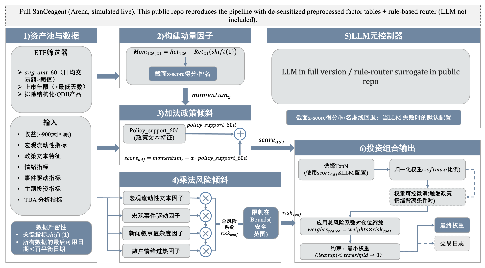

# SanCeagent Public (Reproducible Pipeline)


> A **public, reproducible** version of my SanCeagent-style ETF rotation system.
> This repo keeps the **same engineering pipeline & interfaces** as the private full version, while using
> **de-sensitized, pre-processed NLP factor tables + small CSV demo market data** for verification.

## What you can verify here
- **Weekly rebalance calendar**: week-end trading day (Fri / holiday-adjusted)
- **Rule router (public surrogate for “LLM meta routing”)**: dynamically adjusts
  `topk / softmax_temp / no_trade_band / sticky_buffer` based on macro/regime proxies
- **Turnover controls**: sticky topK + no-trade band
- **End-to-end pipeline**: factors → scores → weights → backtest → trades/turnover → benchmark → **audit logs**
- **CI green**: install + lint + tests + demo-run on clean environment


## Private full version (verified on Arena, not published)

- The full SanCeagent runs on **CUFEL-Q Arena** *(simulated live; not real live trading)* and includes
  **private NLP factor pipeline + proprietary prompts / LLM routing**.
- This public repo reproduces the **end-to-end engineering pipeline** with **de-sensitized, preprocessed factor tables**
  and a **rule-based router surrogate (LLM not included)** — for auditability & reproducibility, not private alpha sources.


Arena verification links (keep as-is):
- Leaderboard: https://cufel.cufe.edu.cn/cufel-q/leaderboard
- SanCeagent (full): https://cufel.cufe.edu.cn/cufel-q/agents/28


## Architecture
Public repo implements the reproducible pipeline; the private full version replaces the router with LLM-meta and uses licensed/private data.



### Full SanCeagent (Arena) — structure framework (private, not in this repo)
> Below is a **framework diagram** of the “complete” Arena agent.  
> Public repo keeps the same **interfaces & stages**, but replaces private parts with **rule router + de-sensitized inputs**.

```text
Full SanCeagent (private / Arena)
├─ data_ingestion/
│  ├─ market_prices (licensed / db)
│  ├─ universe_builder
│  └─ calendar & corporate actions
├─ nlp_pipeline/                      (PRIVATE)
│  ├─ news/filings collection
│  ├─ NLP extraction & scoring
│  └─ factor table generation (the 6 CSVs are outputs of this stage)
├─ signals/
│  ├─ factor alignment (<= D-1)
│  └─ cross-factor sanity checks
├─ router/
│  ├─ LLM meta routing (A/B/C prompts, caching, retries)   (PRIVATE)
│  └─ regime controls → strategy knobs
├─ portfolio/
│  ├─ scoring / ranking
│  ├─ constraints & turnover control
│  └─ target weights
├─ backtest & evaluation/
│  ├─ transaction costs / slippage / thresholds
│  ├─ benchmark comparison
│  └─ metrics + reporting
└─ audit & monitoring/
   ├─ per-rebalance audit logs
   └─ reproducibility artifacts
```

## TL;DR
```bash
python -m venv .venv && source .venv/bin/activate \
  && pip install -r requirements.txt \
  && python scripts/run_demo.py --config config/sance_public.yaml
```

## Quickstart (public demo)

### 1) Setup
```bash
python -m venv .venv
source .venv/bin/activate
pip install -r requirements.txt
```

### 2) Run demo
```bash
python scripts/run_demo.py --config config/sance_public.yaml
```

### 3) Outputs
Generated under `outputs/`:
- `weights.csv` — rebalance-day portfolio weights
- `nav_series.csv` — NAV series
- `positions_df.csv` — positions by date
- `trade_records.csv` — trades
- `turnover_records.csv` — turnover records
- `benchmark_equal_weight.csv` — benchmark weights (equal-weight buy&hold)
- `benchmark_nav.csv` — benchmark NAV
- `backtest_result.json` — index file for all artifacts
- `audit/audit.jsonl` — per-rebalance audit trail (inputs / router params / picks / weights)

> Note: Public demo metrics validate **pipeline + execution logic** only and are **not representative** of private full-version performance.

## Configuration (config/sance_public.yaml)
### Backtest window
- `start`, `end`: backtest window (YYYY-MM-DD)

### Rebalance
- `rebalance_mode`:`week_end`(week-end trading day; Fri / holiday-adjusted)

### Scoring & portfolio knobs
- `score_weights`: weights for SanCe-style signals
keys: `sector_sentiment`, `narrative_price_gap`, `policy_sent_gap`
- `use_price_mom`: add optional price momentum as an extra term (public proxy)
- `mom_lookback`, `mom_weight`: momentum lookback window and weight
- `base_topk`, `base_softmax_temp`: base selection breadth and concentration
- `min_weight`: drop very small weights after normalization
- `no_trade_band`: ignore tiny weight changes to reduce churn
- `sticky_buffer`: keep some previous holdings if still near the top

## Data & Factors (public)
This repo uses **pre-processed factor tables** as inputs (already produced by a private NLP pipeline in the full system).
The public version **does not** include proprietary NLP extraction / prompt logic; it only consumes the resulting factor tables and enforces:
- schema/contract checks
- alignment to trading calendar
- **<= D-1** signal usage (anti look-ahead)
Demo market data is stored in demo_data/ and intentionally kept small (subset / recent window) for CI and reproducibility.

## Demo data layout
```text
demo_data/
├─ universe.csv
├─ prices.csv
└─ factors/
   ├─ etf_narrative_vs_price_gap_factor.csv
   ├─ etf_policy_vs_sent_gap_factor.csv
   ├─ etf_sector_sentiment_factor.csv
   ├─ macro_liquidity_factor.csv
   ├─ news_tda_factor.csv
   └─ retail_sentiment_factor.csv
```

## Factor CSV contracts (what the pipeline expects)
- All factor tables must have a `date` column.
- ETF-level factors must have a `code` column (ETF code as string).
- Macro/date-only factors may not have `code` (or will be treated as “global” and broadcast to all codes).

The public agent is tolerant to some column variations and will pick the “best available” columns:
- Narrative vs price gap: prefers `gap_score` (else `gap_pct`)
- Policy vs sentiment gap: prefers `contrarian_score` (else `sent_minus_policy_gap`)
- Sector sentiment: prefers `sina_sector_sentiment` (else `sina_sector_sentiment_raw`)
- Macro liquidity: prefers `liq_20d` (else `liq_raw`)
- News TDA: expects `news_tda_score` (or the single non-date column)
- Retail sentiment: expects `retail_overheat_z` (or uses `retail_heat_raw` / `sina_score` / `east_score` as fallback)

## Evidence chain (for verification)
1. **Arena**: full SanCeagent continuously updated (simulated live)
2. **Public repo**: reproducible pipeline (factors → router → weights → backtest → audit)
3. **CI**: green checks on clean environment

## Repository structure
```text
.
├─ config/
│  └─ sance_public.yaml
├─ demo_data/
│  ├─ universe.csv
│  ├─ prices.csv
│  └─ factors/...
├─ outputs/                      (generated)
├─ scripts/
│  ├─ run_demo.py
│  ├─ generate_demo_market_data.py
│  └─ make_demo_subset.py
├─ src/
│  ├─ agent/                     (SanCe public agent: signals → scoring → weights → audit)
│  ├─ router/                    (rule router: public surrogate of LLM meta routing)
│  ├─ signals/                   (factor-panel contract & alignment; no NLP here)
│  ├─ data/                      (CSV provider; reserved for future DB/API integration)
│  ├─ portfolio/                 (turnover controls / weight helpers)
│  └─ reporting/                 (WIP / extension point)
├─ vendor/GeneralBacktest/       (backtest engine treated as external dependency)
└─ tests/                        (smoke tests: import + reproducibility)
```

## Optional: regenerate / subset demo market data
This repo ships with `demo_data/` for reproducibility.
If you want to regenerate **locally** (e.g., change date window / ETF count):
```bash
python scripts/generate_demo_market_data.py --help
python scripts/generate_demo_market_data.py
```
If you need an even smaller dataset for CI speed:
```bash
python scripts/make_demo_subset.py --help
python scripts/make_demo_subset.py
```

## Dev checks (same as CI)
```bash
ruff check .
pytest -q
python scripts/run_demo.py --config config/sance_public.yaml
```

## Notes
- Public version focuses on **pipeline reproducibility & auditability**.
- Signals in `demo_data/factors/` are **already processed** results (NLP-derived factors in the full system).
- The public router is a **rule-based surrogate** for the private “LLM meta routing”.

## Disclaimer
For research/education only. Not investment advice.